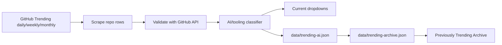

# Trending Refresh Flow

This is how AgentKitBoard updates the generated trending section.

```mermaid
flowchart LR
  A[GitHub Trending daily/weekly/monthly] --> B[Scrape repo rows]
  B --> C[Validate with GitHub API]
  C --> D[AI/tooling classifier]
  D --> E[Current dropdowns]
  D --> F[data/trending-ai.json]
  F --> G[data/trending-archive.json]
  G --> H[Previously Trending Archive]
```

The README stays focused on the repo lists. This doc keeps the automation diagram for reference.
